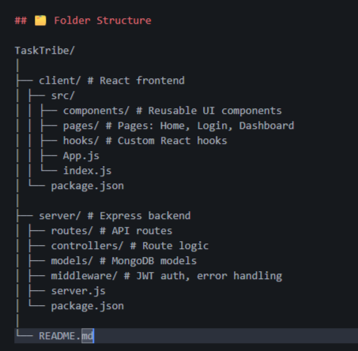

# TaskTribe

TaskTribe is a **collaborative skill-sharing platform** where anyone with skills or expertise can **post tasks, offer help, and collaborate** with others. It’s designed to connect people who want to help and those who need assistance, regardless of age, profession, or background.

## 🚀 Features

- 🔐 **User Authentication:** Secure registration and login with JWT.
- 📝 **Post & Browse Tasks:** Add new tasks and view others' tasks.
- 📋 **Task Pool:** Browse tasks you can contribute to.
- ⚡ **Real-Time Updates:** Instantly see new tasks and updates.
- 📱 **Responsive UI:** Modern and clean design for both mobile & desktop.

---

## 🖥️ Screenshots / Preview

> **Replace these links with your actual screenshots or GIFs**

  
  

---

## 🧱 Tech Stack

**Frontend:**

- React.js (Functional Components + Hooks)
- Tailwind CSS
- Framer Motion

**Backend:**

- Node.js & Express.js
- MongoDB (Mongoose)
- JWT Authentication

---

## 🗂️ Folder Structure

